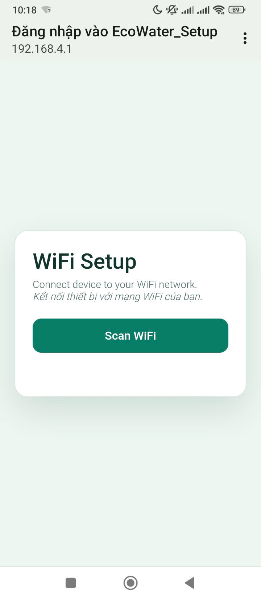
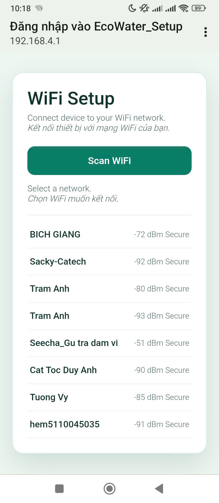
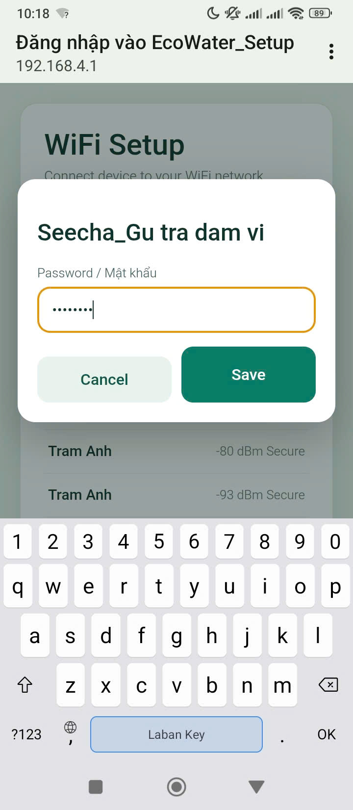
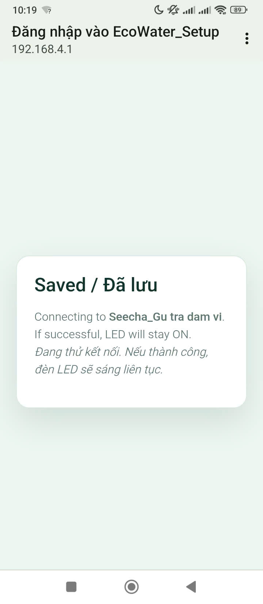

# EcoWifi Library

A robust, memory-safe, and standalone WiFi Manager library with a captive portal for **ESP8266** and **ESP32** devices. 

*(**Tiếng Việt ở bên dưới / Vietnamese below**)*

---

## 🇺🇸 English Documentation

### Overview
**EcoWifi** is designed to simplify WiFi provisioning for IoT projects. It gracefully handles network connections, automatically reconnects when disconnected, and provides an elegant Captive Portal allowing users to configure WiFi credentials via their smartphone or PC without hardcoding them. 

### Key Features
- **Cross-Platform Compatibility:** Fully supports both ESP8266 and ESP32 with the exact same API.
- **Smart Captive Portal:** If WiFi is unavailable or the user holds the setup button, it launches a temporary Access Point (AP) and an integrated Web UI/Captive Portal for WiFi configuration.
- **EEPROM Memory Safe:** Prevents flash memory wear and fragmentation. Credentials overwrite precisely the same block, ensuring your memory remains safe no matter how many times the WiFi config is updated.
- **Multiple Fallback Networks:** Hardcode up to 3 fallback/default WiFi connections.
- **Auto-Reconnect & Status Indication:** Automatically monitors connection drops and intelligently blinks an assigned LED to show device states (Connecting, AP Mode, Connected).

### Installation
1. Go to this repository and click **Code -> Download ZIP**.
2. Open the Arduino IDE.
3. Navigate to **Sketch** -> **Include Library** -> **Add .ZIP Library...**
4. Select the downloaded `.zip` file. (Or extract it manually into your `Documents/Arduino/libraries/` folder).

### How to Use & Workflow
1. Include the library: `#include <EcoWifi.h>`.
2. Configure settings in `setup()`: define the Setup AP credentials, add fallback networks, and initialize with your Button and LED pins.
3. Run `EcoWifi.handle()` and `EcoWifi.maintain()` within your `loop()`.
4. **Triggering Setup Mode:** Power up the device. If it cannot connect to the primary or fallback networks, press and hold the designated Setup Button for **6 seconds**. The Status LED will blink, entering AP Mode.
5. **Connecting:** On your smartphone/PC, connect to the new Setup AP (e.g., `EcoWater_Setup`). A web portal will automatically pop up. (If not, navigate to `192.168.4.1`). Scan for networks, enter your password, and save. The device will auto-reboot to connect.

### Example Code
Please check the `examples/BasicSetup` folder in Arduino IDE: **File** -> **Examples** -> **EcoWifi** -> **BasicSetup**.

---

## 🇻🇳 Hướng dẫn bằng Tiếng Việt (Vietnamese)

### Tổng quan
**EcoWifi** là thư viện quản lý kết nối WiFi dành cho các dự án IoT. Nó đơn giản hóa việc kết nối mạng, tự động kết nối lại khi rớt mạng, và cung cấp một trang cấu hình Web (Captive Portal) đẹp mắt để người dùng tự cài đặt WiFi bằng điện thoại hoặc máy tính mà không cần nạp lại code bằng máy tính.

### Tính năng Nổi bật
- **Hỗ trợ cả ESP8266 & ESP32:** Tự động nhận diện board và sử dụng đúng nhân hệ thống tương ứng mà không cần bạn phải thay đổi code.
- **Trang Cấu hình Captive Portal:** Khi thiết bị không thể kết nối WiFi hoặc bạn ấn giữ nút cài đặt, thiết bị sẽ phát ra một WiFi ảo. Điện thoại khi kết nối vào sẽ tự động nhảy lên trang Web cài đặt WiFi mới cực kỳ chuyên nghiệp.
- **An toàn cho Bộ nhớ EEPROM:** Tránh tình trạng phân mảnh hay làm đầy bộ nhớ Flash/EEPROM. Dữ liệu WiFi luôn được ghi đè một cách tối ưu vào một vị trí duy nhất, bảo vệ tuổi thọ của chip ngay cả khi thay đổi WiFi hàng nghìn lần.
- **Hỗ trợ Nhiều WiFi Lưu Trữ:** Bạn có thể điền trước (hardcode) tối đa 3 cấu hình WiFi để thiết bị xoay vòng thử kết nối.
- **Chỉ báo LED Thông minh:** Tích hợp chân LED để nhấp nháy báo hiệu trạng thái (Đang kết nối, Chế độ cài đặt, Đã kết nối). Tự động theo dõi và kết nối lại khi mất mạng.

### Cài đặt
1. Tải toàn bộ mã nguồn này về dưới dạng file `.zip`.
2. Mở Arduino IDE.
3. Chọn menu **Sketch** -> **Include Library** -> **Add .ZIP Library...**
4. Chọn file `.zip` vừa tải về. (Hoặc giải nén thẳng thư mục này vào `Documents/Arduino/libraries/`).

### Quy trình sử dụng
1. Thêm thư viện: `#include <EcoWifi.h>`.
2. Gõ các lệnh cấu hình vào hàm `setup()`: thiết lập tên/mật khẩu WiFi phát ra khi cài đặt, thêm các mạng WiFi mặc định, sau đó khởi tạo chân Nút nhấn và Đèn LED.
3. Liên tục gọi hàm `EcoWifi.handle()` và `EcoWifi.maintain()` bên trong hàm `loop()`.
4. **Vào Chế độ Cài đặt:** Cắm điện. Nếu mạch không kết nối được vào WiFi nào, hãy **nhấn giữ nút Cài đặt 6 giây**. Đèn LED sẽ nháy báo hiệu đã bật chế độ phát WiFi.
5. **Cấu hình WiFi:** Dùng điện thoại/Máy tính kết nối vào WiFi của mạch phát ra (vd: `EcoWater_Setup`). Màn hình chọn WiFi sẽ tự động hiện lên (nếu không hiện, hãy vào web `192.168.4.1`). Quét mạng, điền mật khẩu và ấn Lưu. Thiết bị sẽ tự thoát và kết nối lại vào wifi mới.

### Code mẫu
Vui lòng mở file ví dụ có sẵn bằng cách vào Arduino IDE: **File** -> **Examples** -> **EcoWifi** -> **BasicSetup**.

---

## 📱 Mobile WiFi Setup Guide / Hướng dẫn cài đặt WiFi trên điện thoại

**Step 1 / Bước 1:** *(Viết nội dung giải thích cho ảnh 1 vào đây...)*
 

**Step 2 / Bước 2:** *(Viết nội dung giải thích cho ảnh 2 vào đây...)*
 

**Step 3 / Bước 3:** *(Viết nội dung giải thích cho ảnh 3 vào đây...)*
 

**Step 4 / Bước 4:** *(Viết nội dung giải thích cho ảnh 4 vào đây...)*
 

**Step 5 / Bước 5:** *(Viết nội dung giải thích cho ảnh 5 vào đây...)*
 

